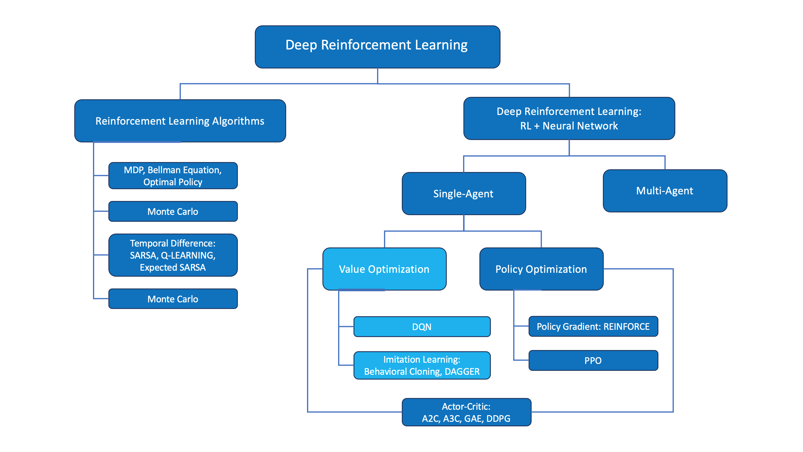

# Deep Reinforcement Learning
## Intro to Reinforcement Learning (RL) and Deep RL (DRL):

<figure align="center">
  
</figure>

### The RL Problem Definition:
* **Framework**: Formalized as a Markov Decision Process (MDP).
* **Components**: Defined by the tuple $(S, A, P, R, \gamma)$.
* **States ($S$)**: The set of all valid environmental situations.
* **Actions ($A$)**: The set of all possible agent moves.
* **Transitions ($P$)**: Probability matrix of moving between specific states.
* **Rewards ($R$)**: Immediate scalar feedback signals from the environment.
* **Discount ($\gamma$)**: Factor balancing immediate versus future rewards.
* **Objective**: Maximize the expected cumulative future discounted reward.

### The RL Problem Solution:
* **Optimal Policy ($\pi^*$)**: Strategy mapping states to the best action choice.
* **State-Value ($V(s)$)**: Expected long-term return starting from state $s$.
* **Action-Value ($Q(s, a)$)**: Expected return executing action $a$ in state $s$.
* **Bellman Equations**: Iterative mathematical relations solving for value functions.

### Monte Carlo Methods:
* **Data Source**: Learns directly from complete, sampled history episodes.
* **Update Timing**: Value adjustments happen only after episodes finish.
* **Mechanism**: Uses empirical mean returns to approximate target metrics.
* **Characteristics**: Zero structural bias but exhibits high statistical variance.

### Temporal Difference (TD) Learning:
* **Bootstrapping**: Updates estimates based on other learned estimates.
* **Update Timing**: Adjustments occur online at every individual step.
* **Hybrid Nature**: Combines Monte Carlo sampling with Dynamic Programming.
* **Characteristics**: Introduces low bias but significantly reduces variance.
* **Foundations**: Forms the core basis for Q-Learning algorithms.

### OpenAI Gym:
* **Definition**: Standardized toolkit for testing reinforcement learning agents.
* **Environments**: Features diverse presets like Atari and robotics benchmarks.
* **Interface**: Uses a unified `step(action)` function call wrapper.
* **Outputs**: Returns `next_state`, `reward`, `terminated`, `truncated`, and `info`.

### RL in Continuous Spaces:
#### Discrete and Continuous Spaces:
DQN: Deep Q Networks
* **Limitation**: DQN applies strictly to discrete action spaces.
* **Mathematical Wall**: Cannot execute `argmax` over infinite action options.
* **Alternative**: Continuous tasks require policy gradient or Actor-Critic methods.

Readings:
Read this [scientific article](https://www.cs.swarthmore.edu/~meeden/cs63/s15/nature15a.pdf) that describes Deep Q-Networks.
Read the [research paper](https://storage.googleapis.com/deepmind-media/dqn/DQNNaturePaper.pdf) that first introduced the Deep Q-Learning algorithm.

#### Discretization:
* **Uniform Grid**: Splitting continuous dimensions into equal mathematical intervals.
* **Non-Uniform Grid**: Varying grid interval sizes based on data density.
* **Failure Mode**: Fails when underlying space is complicated/high-dimensional -> states explode -> infeasible to store Q-values for all states.

#### Tile Coding:
* **Coarse Coding**: Uses multiple overlapping grids called tilings.
* **State Mapping**: Continuous states trigger exactly one tile per layer.
* **Generalization**: Spatially shares structural learning across neighboring coordinates.
* **Efficiency**: Highly efficient feature representation for linear function models.

#### Function Approximation:
* **Concept**: Maps continuous states directly to estimated target values.
* **Generalization**: Estimates values for unseen states without lookup tables.
* **Linear Style**: Expresses value functions as weighted feature sums.

#### Kernel Functions:
* **Definition**: Computes inner products in non-linear high-dimensional spaces.
* **Kernel Trick**: Bypasses explicit coordinate mapping to save computation.
* **Similarity**: Measures distance metrics between continuous state vectors.

#### Non-Linear Function Approximation:
Linear to kernel function approximation, linear to non-linear function approximation, non-linear function approximation to deep neural networks.
* **Core Transition**: Deep neural networks replace restrictive linear feature mappings.
* **Representation**: $v(s, w) = f(x(s)^T w) = f(\sum_i x_i(s) w_i)$.
* **Capabilities**: Processes raw pixels and complex high-dimensional sensory streams.

### Learning and Ressources:
#### Ressources, Links and Literature:
- [Grokking Deep RL](https://www.manning.com/books/grokking-deep-reinforcement-learning)(Code (50% off): gdrludacity50)
- [Student-curated list (google spreadsheet)](https://docs.google.com/spreadsheets/d/19jUvEO82qt3itGP3mXRmaoMbVOyE6bLOp5_QwqITzaM/edit?gid=0#gid=0)
- [Spinning Up in Deep RL (OpenAI) - Keypapers](https://spinningup.openai.com/en/latest/spinningup/keypapers.html)

##  Deep Q Networks (DQN):
### Overview:
* **Definition**: DQN is a model-free (environment-free), off-policy reinforcement learning algorithm.
* **Mechanism**: Uses a deep neural network to approximate the Q-value function, enabling it to handle high-dimensional state spaces. Instead of learning from transition probability matrix P(s'|s, a) or reward function R(s,a), DQN learns directly from raw experience tuples (s, a, r, s'). The network basically tries to identify what to do without predicting any next state.

### Experience Replay:
* **Definition**: Stores past experiences in a replay buffer to break correlation between consecutive samples.
* **Mechanism**: Randomly samples mini-batches from the buffer for training, improving stability and convergence.

- Experiences Replay helps to address one type of correlation: consecutive experience tuplets
- Use experience replay as a database to foundation of supervised reinforcement learning. The agent can learn from past experiences and improve its policy over time.
- Introduce prioritized experience replay, where experiences with higher TD errors are sampled more frequently, allowing the agent to focus on learning from more informative experiences.

### Fixed Q-Targets:
* **Definition**: Uses a separate target network to compute the target Q-values, which is updated less frequently than the main network to stabilize training.
- The target network is a copy of the main Q-network, and its weights are updated periodically to reduce oscillations and divergence during training.

-> In Q-Learning, we update a guess with a guess, and this can potentially lead to harmful correlations. To avoid this, we can update the parameters w in the network q^ to better approximate the action value corresponding to state S and action A with the following update rule:

<figure align="center">
  
</figure>

where w^- are the weights of a separate target network that are not changed during the learning step. And (S, A, R, S') is an experience tuple.

