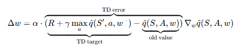
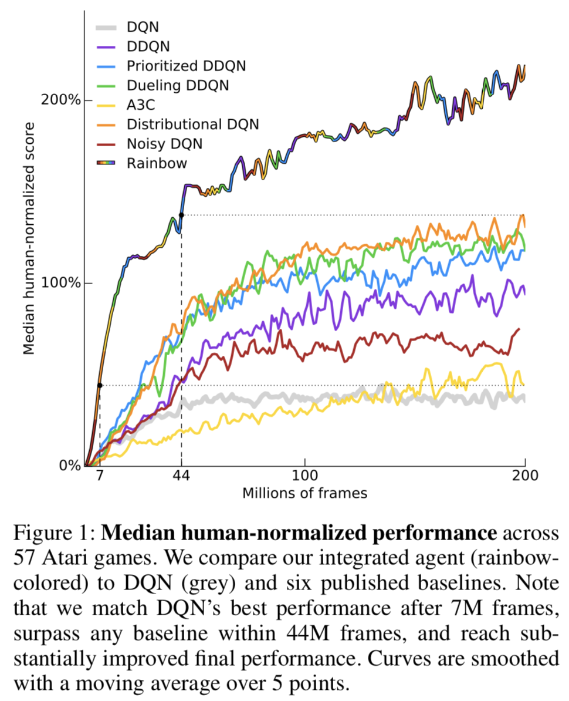
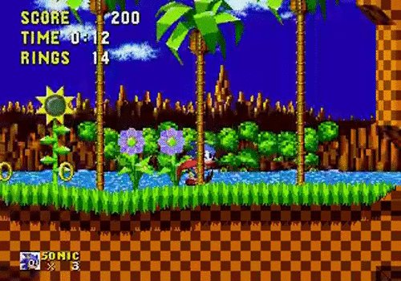
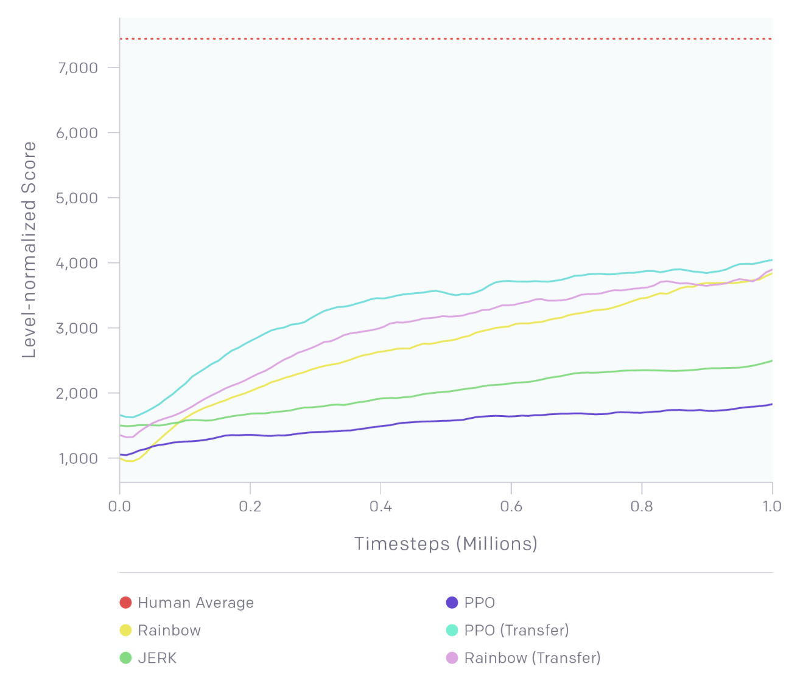
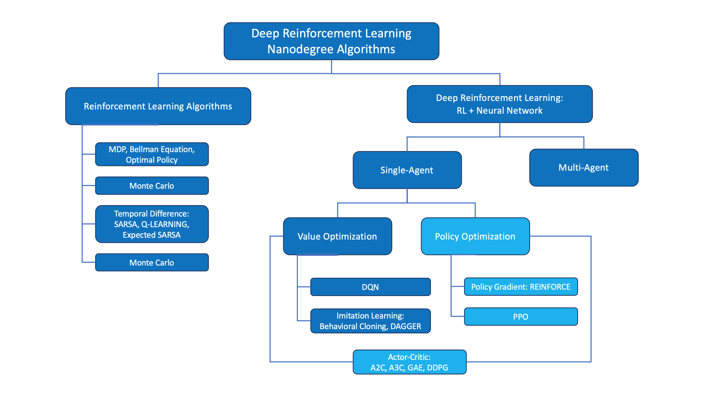

# Deep Reinforcement Learning
## Intro to Reinforcement Learning (RL) and Deep RL (DRL):

<figure align="center">
  
</figure>

### The RL Problem Definition:
* **Framework**: Formalized as a Markov Decision Process (MDP).
* **Components**: Defined by the tuple $(S, A, P, R, \gamma)$.
* **States ($S$)**: The set of all valid environmental situations.
* **Actions ($A$)**: The set of all possible agent moves.
* **Transitions ($P$)**: Probability matrix of moving between specific states.
* **Rewards ($R$)**: Immediate scalar feedback signals from the environment.
* **Discount ($\gamma$)**: Factor balancing immediate versus future rewards.
* **Objective**: Maximize the expected cumulative future discounted reward.

### The RL Problem Solution:
* **Optimal Policy ($\pi^*$)**: Strategy mapping states to the best action choice.
* **State-Value ($V(s)$)**: Expected long-term return starting from state $s$.
* **Action-Value ($Q(s, a)$)**: Expected return executing action $a$ in state $s$.
* **Bellman Equations**: Iterative mathematical relations solving for value functions.

### Monte Carlo Methods:
* **Data Source**: Learns directly from complete, sampled history episodes.
* **Update Timing**: Value adjustments happen only after episodes finish.
* **Mechanism**: Uses empirical mean returns to approximate target metrics.
* **Characteristics**: Zero structural bias but exhibits high statistical variance.

### Temporal Difference (TD) Learning:
* **Bootstrapping**: Updates estimates based on other learned estimates.
* **Update Timing**: Adjustments occur online at every individual step.
* **Hybrid Nature**: Combines Monte Carlo sampling with Dynamic Programming.
* **Characteristics**: Introduces low bias but significantly reduces variance.
* **Foundations**: Forms the core basis for Q-Learning algorithms.

### OpenAI Gym:
* **Definition**: Standardized toolkit for testing reinforcement learning agents.
* **Environments**: Features diverse presets like Atari and robotics benchmarks.
* **Interface**: Uses a unified `step(action)` function call wrapper.
* **Outputs**: Returns `next_state`, `reward`, `terminated`, `truncated`, and `info`.

### RL in Continuous Spaces:
#### Discrete and Continuous Spaces:
DQN: Deep Q Networks
* **Limitation**: DQN applies strictly to discrete action spaces.
* **Mathematical Wall**: Cannot execute `argmax` over infinite action options.
* **Alternative**: Continuous tasks require policy gradient or Actor-Critic methods.

Readings:
Read this [scientific article](https://www.cs.swarthmore.edu/~meeden/cs63/s15/nature15a.pdf) that describes Deep Q-Networks.
Read the [research paper](https://storage.googleapis.com/deepmind-media/dqn/DQNNaturePaper.pdf) that first introduced the Deep Q-Learning algorithm.

#### Discretization:
* **Uniform Grid**: Splitting continuous dimensions into equal mathematical intervals.
* **Non-Uniform Grid**: Varying grid interval sizes based on data density.
* **Failure Mode**: Fails when underlying space is complicated/high-dimensional -> states explode -> infeasible to store Q-values for all states.

#### Tile Coding:
* **Coarse Coding**: Uses multiple overlapping grids called tilings.
* **State Mapping**: Continuous states trigger exactly one tile per layer.
* **Generalization**: Spatially shares structural learning across neighboring coordinates.
* **Efficiency**: Highly efficient feature representation for linear function models.

#### Function Approximation:
* **Concept**: Maps continuous states directly to estimated target values.
* **Generalization**: Estimates values for unseen states without lookup tables.
* **Linear Style**: Expresses value functions as weighted feature sums.

#### Kernel Functions:
* **Definition**: Computes inner products in non-linear high-dimensional spaces.
* **Kernel Trick**: Bypasses explicit coordinate mapping to save computation.
* **Similarity**: Measures distance metrics between continuous state vectors.

#### Non-Linear Function Approximation:
Linear to kernel function approximation, linear to non-linear function approximation, non-linear function approximation to deep neural networks.
* **Core Transition**: Deep neural networks replace restrictive linear feature mappings.
* **Representation**: $v(s, w) = f(x(s)^T w) = f(\sum_i x_i(s) w_i)$.
* **Capabilities**: Processes raw pixels and complex high-dimensional sensory streams.

### Learning and Ressources:
#### Ressources, Links and Literature:
- [Grokking Deep RL](https://www.manning.com/books/grokking-deep-reinforcement-learning)(Code (50% off): gdrludacity50)
- [Student-curated list (google spreadsheet)](https://docs.google.com/spreadsheets/d/19jUvEO82qt3itGP3mXRmaoMbVOyE6bLOp5_QwqITzaM/edit?gid=0#gid=0)
- [Spinning Up in Deep RL (OpenAI) - Keypapers](https://spinningup.openai.com/en/latest/spinningup/keypapers.html)

##  Deep Q Networks (DQN):
### Overview:
* **Definition**: DQN is a model-free (environment-free), off-policy reinforcement learning algorithm.
* **Mechanism**: Uses a deep neural network to approximate the Q-value function, enabling it to handle high-dimensional state spaces. Instead of learning from transition probability matrix P(s'|s, a) or reward function R(s,a), DQN learns directly from raw experience tuples (s, a, r, s'). The network basically tries to identify what to do without predicting any next state.

### Experience Replay:
* **Definition**: Stores past experiences in a replay buffer to break correlation between consecutive samples.
* **Mechanism**: Randomly samples mini-batches from the buffer for training, improving stability and convergence.

- Experiences Replay helps to address one type of correlation: consecutive experience tuplets
- Use experience replay as a database to foundation of supervised reinforcement learning. The agent can learn from past experiences and improve its policy over time.
- Introduce prioritized experience replay, where experiences with higher TD errors are sampled more frequently, allowing the agent to focus on learning from more informative experiences.

### Fixed Q-Targets:
* **Definition**: Uses a separate target network to compute the target Q-values, which is updated less frequently than the main network to stabilize training.
- The target network is a copy of the main Q-network, and its weights are updated periodically to reduce oscillations and divergence during training.

-> In Q-Learning, we update a guess with a guess, and this can potentially lead to harmful correlations. To avoid this, we can update the parameters w in the network q^ to better approximate the action value corresponding to state S and action A with the following update rule:

<figure align="center">
  
</figure>

where w^- are the weights of a separate target network that are not changed during the learning step. And (S, A, R, S') is an experience tuple.

### Double DQN:
* **Definition**: Double DQN addresses the [overestimation bias](https://www.ri.cmu.edu/pub_files/pub1/thrun_sebastian_1993_1/thrun_sebastian_1993_1.pdf) in Q-learning by decoupling the action selection and action evaluation.
* **Mechanism**: Uses the main network to select the best action and the target network to evaluate its value, reducing overestimation.
[Double Q-Learning](https://arxiv.org/pdf/1509.06461) has been shown to work well in practice to help with this.

#### Overestimation of Q-values
The first problem we are going to address is the overestimation of action values that Q-learning is prone to.

The update rule for Q-learning with function approximation is

$$
\Delta w = \alpha\left(R + \gamma \max_a \hat{q}(S', a, w) - \hat{q}(S, A, w)\right) \nabla_w \hat{q}(S, A, w)
$$

where $R + \gamma \max_a \hat{q}(S', a, w)$ is the TD target.

#### TD Target
To better understand the $\max$ operation in the TD target, we can expand it as

$$
R + \gamma \hat{q}\left(S', \arg\max_a \hat{q}(S', a, w), w\right)
$$

It's possible for the $\arg\max$ operation to make mistakes, especially in the early stages. This is because the Q-value estimate $\hat{q}$ is still evolving, and we may not have gathered enough information to identify the best action. The accuracy of Q-values depends heavily on which actions have been tried and which neighboring states have been explored.

#### Double Q-Learning
Double Q-learning can make estimation more robust by selecting the best action using one set of parameters $w$, but evaluating it using a different set of parameters $w'$.

$$
R + \gamma \hat{q}\left(S', \arg\max_a \hat{q}(S', a, w), w'\right)
$$

Where do we get the second set of parameters $w'$ from?

In the original formula of double Q-learning, two value functions are basically maintained, and randomly choose one of them to update at each step using the other only for evaluating actions.
When using DQNs with fixed Q targets, we already have an alternate set of parameters $w^-$. Since $w^-$ has been kept frozen for a while, it is different enough from $w$ that it can be reused for this purpose.

#### Notes
You can read more about Double DQN (DDQN) by perusing this [research paper](https://arxiv.org/abs/1509.06461).

If you'd like to dig deeper into how Deep Q-Learning overestimates action values, please read this [research paper](https://www.ri.cmu.edu/pub_files/pub1/thrun_sebastian_1993_1/thrun_sebastian_1993_1.pdf).

### Prioritized Experience Replay
Deep Q-Learning samples experience transitions uniformly from a replay memory. [Prioritized experienced replay](https://arxiv.org/abs/1511.05952) is based on the idea that the agent can learn more effectively from some transitions than from others, and the more important transitions should be sampled with higher probability.

#### TD Error $\delta_t$
Criteria used to assign priorities to each tuple:

$$
\delta_t = R_{t+1} + \gamma \max_a \hat{q}(S_{t+1}, a, w) - \hat{q}(S_t, A_t, w)
$$

The bigger the error, the more we expect to learn from that tuple.

#### Measure of Priority
The priority is based on the magnitude of TD error:

$$
p_t = |\delta_t|
$$

Priority is stored along with each corresponding tuple in the replay buffer.

#### Sampling Probability
Sampling probability is computed from priority when creating batches:

$$
P(i) = \frac{p_i}{\sum_k p_k}
$$

#### Improvements to Prioritized Experience Replay
#### TD Error Is Zero
Problem: If the TD error is zero, then the priority value of the tuple and hence its probability of being picked will also be zero. This does not necessarily mean we have nothing more to learn from such a tuple. It might be the case that our estimate was close due to the limited samples we had visited up to that point.

Solution: To prevent tuples from being starved for selection, we can add a small constant $\varepsilon$ to every priority value. Then priority is expressed as:

$$
p_t = |\delta_t| + \varepsilon
$$

#### Greedy Usage of Priority Values
Problem: Greedily using priority values may lead to a small subset of experiences being replayed over and over, resulting in overfitting to that subset.

Solution: Reintroduce some element of uniform random sampling. This adds another hyperparameter $\alpha$ used to redefine sampling probability as:

$$
P(i) = \frac{p_i^{\alpha}}{\sum_k p_k^{\alpha}}
$$

#### Adjustment to the Update Rule
When we use prioritized experience replay, we make one adjustment to the update rule:

$$
\Delta w = \alpha \left(\frac{1}{N} \cdot \frac{1}{P(i)}\right)^{\beta} \delta_i \, \nabla_w \hat{q}(S_i, A_i, w)
$$

where $\left(\frac{1}{N} \cdot \frac{1}{P(i)}\right)^{\beta}$ is the importance-sampling weight.

#### Notes
You can read more about prioritized experience replay by perusing this [research paper](https://arxiv.org/abs/1511.05952).

### Dueling DQN
Currently, in order to determine which states are (or are not) valuable, we have to estimate the corresponding action values for each action. However, by replacing the traditional Deep Q-Network (DQN) architecture with a [dueling architecture](https://arxiv.org/abs/1511.06581), we can assess the value of each state, without having to learn the effect of each action.

The core idea of dueling networks is to use two streams:

- One stream estimates the state-value function:

$$
V(s)
$$

- One stream estimates the advantage for each action:

$$
A(s, a)
$$

Finally, by combining the state and advantage values, we obtain the desired Q-values:

$$
Q(s, a) = V(s) + A(s, a)
$$

#### Notes
You can read more about Dueling DQN by perusing this [research paper](https://arxiv.org/abs/1511.06581).

--> **Resulted in significant improvements over vanilla DQNs**

### Rainbow
So far, you've learned about three extensions to the Deep Q-Networks (DQN) algorithm:

- Double DQN (DDQN)
- Prioritized experience replay
- Dueling DQN
But these aren't the only extensions to the DQN algorithm! Many more extensions have been proposed, including:

- Learning from [multi-step bootstrap targets](https://arxiv.org/abs/1602.01783)
- [Distributional DQN](https://arxiv.org/abs/1707.06887)
- [Noisy DQN](https://arxiv.org/abs/1706.10295)
Each of the six extensions address a different issue with the original DQN algorithm.

Researchers at Google DeepMind recently tested the performance of an agent that incorporated all six of these modifications. The corresponding algorithm was termed [Rainbow](https://arxiv.org/abs/1710.02298).

It outperforms each of the individual modifications and achieves state-of-the-art performance on Atari 2600 games!

<figure align="center">
  
</figure>

A plot showing the median human-normalized performance of various DQN algorithms on 57 Atari games over millions of frames, with Rainbow achieving the highest performance.
Performance on Atari games: comparison of Rainbow to six baselines.

#### In Practice
In mid-2018, OpenAI held a [contest](https://openai.com/index/retro-contest-results/), where participants were tasked to create an algorithm that could learn to play the [Sonic the Hedgehog]([opens in a new tab](https://en.wikipedia.org/wiki/Sonic_the_Hedgehog)) game. The participants were tasked to train their RL algorithms on provided game levels; then, the trained agents were ranked according to their performance on previously unseen levels.

Thus, the contest was designed to assess the ability of trained RL agents to generalize to new tasks.

<figure align="center">
  
</figure>

Sonic The Hedgehog ([Source](https://openai.com/index/retro-contest/))

One of the provided baseline algorithms was Rainbow DQN. If you'd like to play with this dataset and run the baseline algorithms, you're encouraged to follow the [setup instructions](https://retro.readthedocs.io/en/latest/getting_started.html).

<figure align="center">
  
</figure>

Baseline results on the Retro Contest (test set) ([Source](https://openai.com/index/retro-contest/))

## Unity ML-Agents
Unity Machine Learning Agents (ML-Agents) is an open-source Unity plugin that enables games and simulations to serve as environments for training intelligent agents.

For game developers, these trained agents can be used for multiple purposes, including controlling NPC(opens in a new tab) behavior (in a variety of settings such as multi-agent and adversarial), automated testing of game builds and evaluating different game design decisions pre-release.

In this course, you will use Unity's rich environments to design, train, and evaluate your own deep reinforcement learning algorithms. You can read more about ML-Agents by perusing the GitHub repository(opens in a new tab).
[unity github](https://github.com/Unity-Technologies/ml-agents)

# Policy Based Methods:

The third part of this nanodegree program covers policy-based methods in deep reinforcement learning. You can find all of the coding exercises from the lessons in this [GitHub repository](https://github.com/udacity/deep-reinforcement-learning).

#### Lesson: Introduction to Policy-Based Methods
In this lesson, you will learn about methods such as hill climbing, simulated annealing, and adaptive noise scaling. You'll also learn about cross-entropy methods and evolution strategies.

#### Lesson: Policy Gradient Methods
In this lesson, you'll study REINFORCE, along with improvements we can make to lower the variance of policy gradient algorithms.

#### Lesson: Proximal Policy Optimization
In this lesson, you'll learn about Proximal Policy Optimization (PPO), a cutting-edge policy gradient method.

#### Lesson: Actor-Critic Methods
In this lesson, you'll learn how to combine value-based and policy-based methods, bringing together the best of both worlds, to solve challenging reinforcement learning problems.

#### Lesson: Deep RL for Finance (Optional)
In this optional lesson, you'll learn how to apply deep reinforcement learning techniques for optimal execution of portfolio transactions.

#### Ressources:

Read the most famous [blog post](http://karpathy.github.io/2016/05/31/rl/) on policy gradient methods.
Implement a policy gradient method to win at Pong in this [Medium post](https://medium.com/@dhruvp/how-to-write-a-neural-network-to-play-pong-from-scratch-956b57d4f6e0).
Learn more about [evolution strategies](https://blog.openai.com/evolution-strategies/) from OpenAI.

<figure align="center">
  
</figure>

## Policies:

Neural network that encodes action probabilities ([Source](https://openai.com/index/evolution-strategies/))

