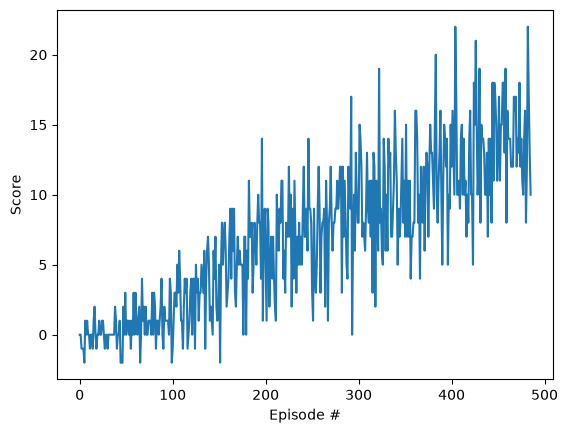

# Project 1 Report: Navigation (Value-Based Methods)

## 1. Overview

This project trains a Deep Q-Network (DQN) agent to solve the Unity Banana Navigation environment.

- State space (required project environment): 37-dimensional vector observation
- Action space: 4 discrete actions
  - 0: move forward
  - 1: move backward
  - 2: turn left
  - 3: turn right
- Reward:
  - +1 for yellow banana
  - -1 for blue banana
- Solve criterion: average score >= +13 over 100 consecutive episodes


## 2. Learning Algorithm

The implementation uses off-policy DQN with experience replay and a target network.

At each environment step:
1. Choose action with epsilon-greedy policy from the local Q-network.
2. Store transition (s, a, r, s', done) in replay memory.
3. Every UPDATE_EVERY steps, sample a minibatch from replay memory (after warmup).
4. Compute TD targets with target network:

	Q_target = r + gamma * max_a' Q_target(s', a') * (1 - done)

5. Update local network by minimizing TD error.
6. Soft-update target network parameters:

	theta_target <- tau * theta_local + (1 - tau) * theta_target

Code references:
- Agent and replay: p1_navigation/dqn_agent.py
- Network definitions: p1_navigation/model.py


## 3. Hyperparameters

### Shared/default values

- BUFFER_SIZE = 1e6
- BATCH_SIZE = 64
- GAMMA = 0.99
- TAU = 1e-3
- UPDATE_EVERY = 4

### Vector-state (MLP) setup

- Optimizer: Adam
- Learning rate: 5e-4
- Loss: MSE
- Replay warmup: >= batch size

### Pixel/CNN setup

- Optimizer: RMSprop
- Learning rate: 2.5e-4
- Loss: Smooth L1 (Huber)
- Replay warmup: typically 10k transitions (configurable)
- Gradient clipping: max norm 10.0

### Epsilon schedule used in notebook training

- eps_start = 1.0
- eps_end = 0.01
- eps_decay = 0.995


## 4. Model Architectures

## 4.1 QNetwork (vector observations)

Used when training on the 37-dimensional state.

- Input: 37
- FC1: 37 -> 64, ReLU
- FC2: 64 -> 64, ReLU
- FC3: 64 -> action_size

Implemented in p1_navigation/model.py as QNetwork.

## 4.2 DQNNatureNetwork (pixel observations)

Used for VisualBanana when state is formed as 4 stacked grayscale frames (4 x 84 x 84).

- Conv1: in=4, out=32, kernel=8, stride=4, ReLU
- Conv2: in=32, out=64, kernel=4, stride=2, ReLU
- Conv3: in=64, out=64, kernel=3, stride=1, ReLU
- Flatten: 7 x 7 x 64 = 3136
- FC1: 3136 -> 512, ReLU
- FC2: 512 -> action_size

Implemented in p1_navigation/model.py as DQNNatureNetwork.


## 5. Reward Plot and Solve Result

### Vector-state (MLP) training
- Notebook: p1_navigation/Navigation.ipynb



Reported result:

- Environment solved in: 386 episodes
- Average score over last 100 episodes at solve time: 13.01

    ```text
    Episode 100	Average Score: 0.49
    Episode 200	Average Score: 4.31
    Episode 300	Average Score: 7.39
    Episode 400	Average Score: 10.18
    Episode 486	Average Score: 13.01
    Environment solved in 386 episodes!	Average Score: 13.01
    ```

### Optional pixel-based (CNN) training
- Notebook: p1_navigation/Navigation_Pixels.ipynb


- Environment solved in: <N> episodes
- Average score over last 100 episodes at solve time: <score>

    ```text
    Episode 100	Average Score: ...
    Environment solved in <N> episodes!	Average Score: <score>
    ```


## 6. Notes on State Processing (Pixel Mode)

VisualBanana returns frames with shape (1, 84, 84, 3).

Processing pipeline:
1. Squeeze leading singleton dimension -> (84, 84, 3)
2. Convert RGB to luminance grayscale
3. Normalize to [0, 1]
4. Stack 4 consecutive frames -> (4, 84, 84)

This aligns with the CNN input contract in DQNNatureNetwork.


## 7. Ideas for Future Work

Concrete improvements to explore:

1. Double DQN
	- Reduce Q-value overestimation and improve stability.

2. Prioritized Experience Replay
	- Sample transitions by TD-error magnitude for more efficient learning.

3. Dueling Network Architecture
	- Separate value and advantage streams to improve representation learning.

4. Noisy Networks or Parameter Noise
	- Replace epsilon-greedy with learned exploration.

5. N-step Returns
	- Speed up reward propagation and often improve sample efficiency.

6. Better visual preprocessing
	- Frame skipping and max-pooling over frames, if compatible with environment.

7. Hyperparameter sweeps
	- Systematic search over replay warmup, epsilon decay, optimizer parameters, and target update settings.


## 8. Reproducibility

To reproduce training:
1. Follow setup steps in README.md.
2. Run p1_navigation/Navigation.ipynb for vector-state training.
3. Run p1_navigation/Navigation_Pixels.ipynb for optional pixel-based training.
4. Ensure Unity executable paths match your local machine.

