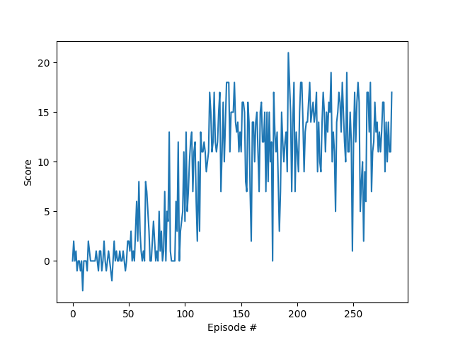
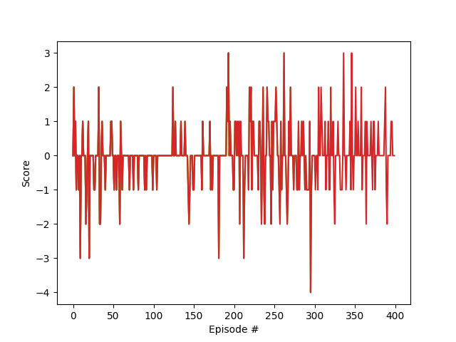

# Project 1 Report: Navigation (Value-Based Methods)
## 1. Overview
This project trains a Deep Q-Network (DQN) agent to solve the Unity Banana Navigation environment.

- State space (required project environment): 
   - Vector: 37-dimensional vector observation
   - Pixel: 4 stacked grayscale frames (4 x 84 x 84)
- Action space: 4 discrete actions
  - 0: move forward
  - 1: move backward
  - 2: turn left
  - 3: turn right
- Reward:
  - +1 for yellow banana
  - -1 for blue banana
- Solve criterion: average score >= +13 over 100 consecutive episodes


## 2. Learning Algorithm
The implementation is a full Rainbow-style DQN combining: experience replay, target network, Double DQN, Prioritized Experience Replay (PER), Noisy Networks for learned exploration, Dueling Network Architecture, and N-step Returns. Each component is independently switchable.

At each environment step:
1. Choose action using epsilon-greedy policy (standard mode) or learned noise (Noisy Networks mode).
2. Accumulate transition into an n-step buffer. Once n transitions are collected (or episode ends), compute the n-step discounted return and store the compressed transition ($s_0, a_0, R_n, s_n, done$) in replay memory with priority (if using PER).
3. Every UPDATE_EVERY steps, sample a minibatch from replay memory (after warmup).
   - Standard sampling: uniform random
   - PER sampling: prioritized by TD-error with importance-sampling weights
4. Compute TD targets using the n-step discounted return $R_n$:
   - Standard DQN: $Q_{target} = R_n + \gamma^n \max_{a'} Q_{target}(s_n, a') (1 - \text{done})$
   - Double DQN: $Q_{target} = R_n + \gamma^n Q_{target}(s_n, \arg\max_{a} Q_{local}(s_n, a)) (1 - \text{done})$

   Double DQN uses the local network to select actions and the target network to evaluate them, reducing overestimation bias. N-step returns speed up reward propagation by bootstrapping n steps ahead (n=1 recovers standard DQN).

5. Update local network by minimizing TD error.
   - If using PER, weight loss by importance-sampling weights.
   - If using Dueling Networks, Q-values are computed as $V(s) + [A(s,a) - \frac{1}{|\mathcal{A}|}\sum_{a'} A(s,a')]$, decomposing state value from action advantage.
   - If using Noisy Networks, no epsilon-greedy; noise in weights provides exploration.
6. Soft-update target network parameters:

$$\theta_{target} \leftarrow \tau \theta_{local} + (1 - \tau) \theta_{target}$$

7. Update transition priorities if using Prioritized Experience Replay (based on TD-error).
8. Resample noise in Noisy Layers if using Noisy Networks.

Code references:
- Agent and replay: p1_navigation/dqn_agent.py
- Network definitions: p1_navigation/model.py


## 3. Hyperparameters
### Switchable Features
- `use_double_dqn` (default: False) – Enable Double DQN for reduced overestimation
- `use_prioritized` (default: False) – Enable Prioritized Experience Replay
- `use_noisy_nets` (default: False) – Enable Noisy Networks for learned exploration
- `use_dueling` (default: False) – Enable Dueling Network Architecture (separate value/advantage streams)
- `n_steps` (default: 1) – Number of steps for N-step returns (1 = standard 1-step DQN)
- `distributional_rl` (default: False) - Enable Distributional RL (C51) (reward maximization by using probability distributions)

Full Rainbow-style usage in notebook:
```python
agent = Agent(
            state_size=37, # vector observation; use 4x84x84 for pixel observation
            action_size=4, 
            seed=0,
            use_double_dqn=True,
            use_prioritized=True,
            use_noisy_nets=True,
            use_dueling=True,
            n_steps=3,
            use_distributional_rl=True
         )
```

### Shared/default values
- BUFFER_SIZE = 4e4
- BATCH_SIZE = 64/128 (vector/pixel)
- GAMMA = 0.99
- TAU = 1e-3
- UPDATE_EVERY = 4

### Vector-state (MLP) setup
- Optimizer: Adam
- Learning rate (LR): 2e-4
- Loss: MSE
- Replay warmup: >= batch size

### Pixel/CNN setup
- Optimizer: RMSprop
- Learning rate (LR): 2.5e-4
- Loss: Smooth L1 (Huber)
- Replay warmup: typically 1k transitions (configurable)

### Epsilon schedule used in notebook training
Standard:
- eps_start = 1.0
- eps_end = 0.01
- eps_decay = 0.995

**Note:** epsilon schedule is ignored when using Noisy Networks; exploration is handled by learned parameter noise.

NoisyNets:
- eps_start = 0.0
- eps_end = 0.0
- eps_decay = 1.0

### Prioritized Experience Replay (PER) hyperparameters
- PER_ALPHA = 0.6 – Priority exponent (higher = more selective sampling)(0.3/0.4 for distributional_rl/noisynets)
- PER_BETA = 0.4 – Importance-sampling exponent (anneals toward 1.0)
- PER_EPSILON = 1e-6 – Small constant to avoid zero priorities


## 4. Model Architectures
### Noisy Networks Note
When `use_noisy_nets=True`, the output layers (QNetwork.fc3 or DQNNatureNetwork.fc2) are replaced with **NoisyLinear** layers. These layers learn exploration through parameter noise rather than epsilon-greedy.

NoisyLinear mechanism:
- Learnable mean weights and biases (μ)
- Learnable noise standard deviations (σ)
- Factorized Gaussian noise sampled each forward pass
- During evaluation (eval mode), uses only means (deterministic)

### Dueling Architecture Note
When `use_dueling=True`, the agent automatically switches to the dueling network variant (`DuelingQNetwork` or `DistributionalDuelingQNetwork`). The final Q-values are computed as:

$$Q(s, a) = V(s) + \left[A(s, a) - \frac{1}{|\mathcal{A}|}\sum_{a'} A(s, a')\right]$$

This decomposition allows the network to learn state values independently of action advantages, improving stability and sample efficiency—especially in states where the choice of action has little effect on the outcome.

### N-step Returns Note
When `n_steps > 1`, transitions are accumulated in an n-step buffer. The stored reward is the discounted n-step sum:

$$R_n = \sum_{i=0}^{n-1} \gamma^i r_{i+1}$$

The TD target then bootstraps from $s_n$ using $\gamma^n$, propagating rewards further per update and often accelerating learning.

## 4.1 QNetwork (vector observations)
Used when training on the 37-dimensional state.

- Input: 37
- FC1: 37 -> 64, ReLU
- FC2: 64 -> action_size
- FC3: 64 -> action_size

Implemented in p1_value_based_methods/navigation_vector/model.py as QNetwork.

## 4.2 DuelingQNetwork (vector observations, Dueling)
Used when `use_dueling=True` with vector observations.

- Input: 37
- FC1: 37 -> 64, ReLU
- FC2: 64 -> 64, ReLU
- **Value stream:** FC3_value: 64 -> 32, ReLU → value: 32 -> 1
- **Advantage stream:** FC3_adv: 64 -> 32, ReLU → advantage: 32 -> action_size
- Output: $Q(s, a) = V(s) + [A(s,a) - \frac{1}{|\mathcal{A}|}\sum_{a'} A(s,a')]$

Implemented in p1_value_based_methods/navigation_vector/model.py as DuelingQNetwork.

## 4.3 DistributionalDuelingQNetwork (vector observations, Dueling, Distributional RL)
Used when `use_dueling=True` and `use_distributional_rl=True` with vector observations.

- Input: 37
- FC1: 37 -> 64, ReLU
- FC2: 64 -> 64, ReLU
- **Value stream:** FC3_value: 64 -> 32, ReLU → value: 32 -> num_atoms
- **Advantage stream:** FC3_adv: 64 -> 32, ReLU →
   advantage: 32 -> action_size * num_atoms
- Output: $Q(s, a) = V(s) + [A(s,a) - \frac{1}{|\mathcal{A}|}\sum_{a'} A(s,a')]$ (per atom)

Implemented in p1_value_based_methods/navigation_vector/model.py as DistributionalDuelingQNetwork.

## 4.3 QNetwork (pixel observations)
Used for VisualBanana when state is formed as 4 stacked grayscale frames (4 x 84 x 84).

- Conv1: in=4, out=32, kernel=8, stride=4, ReLU
- Conv2: in=32, out=64, kernel=4, stride=2, ReLU
- Conv3: in=64, out=64, kernel=3, stride=1, ReLU
- Flatten: 7 x 7 x 64 = 3136
- FC1: 3136 -> 512, ReLU
- FC2: 512 -> action_size

Implemented in p1_value_based_methods/navigation_pixel/model.py as DQNNatureNetwork.

## 4.4 DuelingQNetwork (pixel observations, Dueling)
Used when `use_dueling=True` with pixel observations.

- Conv1: in=4, out=32, kernel=8, stride=4, ReLU
- Conv2: in=32, out=64, kernel=4, stride=2, ReLU
- Conv3: in=64, out=64, kernel=3, stride=1, ReLU
- Flatten: 7 x 7 x 64 = 3136
- FC1 (shared): 3136 -> 512, ReLU
- **Value stream:** fc_value: 512 -> 32, ReLU → value: 32 -> 1
- **Advantage stream:** fc_adv: 512 -> 32, ReLU → advantage: 32 -> action_size
- Output: $Q(s, a) = V(s) + [A(s,a) - \frac{1}{|\mathcal{A}|}\sum_{a'} A(s,a')]$

Implemented in p1_value_based_methods/navigation_pixel/model.py as DuelingDQNNatureNetwork.

## 4.5 DistributionalDuelingQNetwork (pixel observations, Dueling, Distributional RL)
Used when `use_dueling=True` and `use_distributional_rl=True` with pixel observations.

- Conv1: in=4, out=32, kernel=8, stride=4, ReLU
- Conv2: in=32, out=64, kernel=4, stride=2, ReLU
- Conv3: in=64, out=64, kernel=3, stride=1, ReLU
- Flatten: 7 x 7 x 64 = 3136
- FC1 (shared): 3136 -> 512, ReLU
- **Value stream:** fc_value: 512 -> 32, ReLU → value: 32 -> num_atoms
- **Advantage stream:** fc_adv: 512 -> 32, ReLU → advantage: 32 -> action_size * num_atoms
- Output: $Q(s, a) = V(s) + [A(s,a) - \frac{1}{|\mathcal{A}|}\sum_{a'} A(s,a')]$ (per atom)

Implemented in p1_value_based_methods/navigation_pixel/model.py as DistributionalDuelingQNetwork.

### Optional: Noisy Network Variants
When created with `use_noisy_nets=True`, the final output layer(s) of any network are replaced with NoisyLinear:

**QNetwork / DuelingQNetwork / DistributionalDuelingQNetwork:**
- FC3 / value + advantage output layers → NoisyLinear

**CNN based QNetwork / DuelingQNetwork / DistributionalDuelingQNetwork:**
- FC2 / value + advantage output layers → NoisyLinear

All other layers remain deterministic; only the output layer(s) introduce learned noise for exploration.


## 5. Reward Plot and Solve Result
- DQN Rainbow improvements: 
   - PER (replaces random uniform sampling by Importance Sampling (weights (β)), ranks transitions 
   by absolute Temporal Difference (TD) errors)
   - Duelling-DQN (State-Value stream V(s), Action-Advantage stream A(s,a))
   - Double-DQN (eradicates state overestimation bias)
   - n-Step returns (accumulates rewards over n consecutive future steps -> upd. target)
   - Noisy-Networks (replaces ε-greedy exploration)
   - Categorical DQN (Distributional RL / C51) (replaces average expected reward by a probability distribution 
   over all possible future rewards)

### Vector-state (MLP) training
- Script: navigation_vector/main.py

<figure>
  
</figure>

Reported result: (Dueling + Double DQN + PER + Noisy Networks + N-step returns)

    ```text
   Episode 100     Average Score: 1.537    LR: 0.000200
   Episode 200     Average Score: 12.42    LR: 0.000160
   Episode 213     Average Score: 13.04    LR: 0.000160
   Environment solved in 113 episodes!     Average Score: 13.04
    ```

### Optional pixel-based (CNN) training
- Script: navigation_pixel/main.py

<figure>
  
</figure>

Reported result: (Dueling + Double DQN + PER + Noisy Networks + N-step returns, Distributional RL)

    ```text
   Episode 100     Average Score: 0.211    LR: 0.000200
   Episode 200     Average Score: 2.32     LR: 0.000200
   Episode 300     Average Score: 3.35     LR: 0.000200
   Episode 400     Average Score: 3.93     LR: 0.000160
   Episode 476     Average Score: 4.18     LR: 0.000160
   ...
    Environment solved in <N> episodes!	Average Score: <score>
    ```


## 6. Notes on State Processing (Pixel Mode)
VisualBanana returns frames with shape (1, 84, 84, 3).

Processing pipeline:
1. Squeeze leading singleton dimension -> (84, 84, 3)
2. Convert RGB to luminance grayscale
3. Normalize to [0, 1]
4. Stack 4 consecutive frames -> (4, 84, 84)

This aligns with the CNN input contract in DQNNatureNetwork.


## 7. Ideas for Future Work
All major Rainbow DQN components have been implemented. Remaining areas to explore:

1. **Hyperparameter sweeps**
	- Systematic search over n_steps, PER_ALPHA/BETA, epsilon decay, optimizer parameters, and target update settings.

2. **Better visual preprocessing**
	- Frame skipping and max-pooling over frames (Atari-style), if compatible with the VisualBanana environment.

3. **Prioritized replay beta annealing schedule**
	- Currently PER_BETA is fixed at 0.4; annealing it to 1.0 over training is the standard Rainbow practice.

### Previously Completed Improvements-
- **Prioritized Experience Replay** (`use_prioritized`) – Samples transitions by TD-error magnitude with IS correction.
- **Double DQN** (`use_double_dqn`) – Reduces overestimation via decoupled action selection/evaluation.
- **Dueling Network Architecture** (`use_dueling`) – Separates value and advantage streams in both MLP and CNN variants.
- **Noisy Networks** (`use_noisy_nets`) – Replaces epsilon-greedy with learned parameter noise for exploration.
- **N-step Returns** (`n_steps`) – Propagates multi-step discounted rewards before bootstrapping.
- **Distributional RL (C51)** (use_distributional_rl) – Models the distribution of returns rather than expected value, improving stability and performance.


## 8. Reproducibility
To reproduce training:
1. Follow setup steps in README.md.
2. Run navigation_vector/main.py for vector-state training.
3. Run navigation_pixel/main.py for optional pixel-based training.
4. Ensure Unity executable paths match your local machine.
